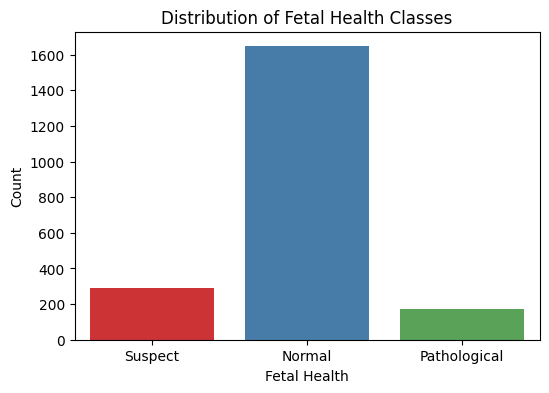
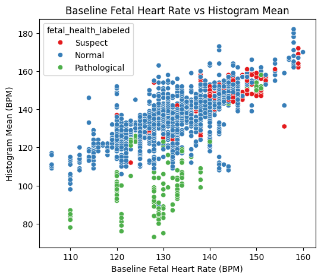
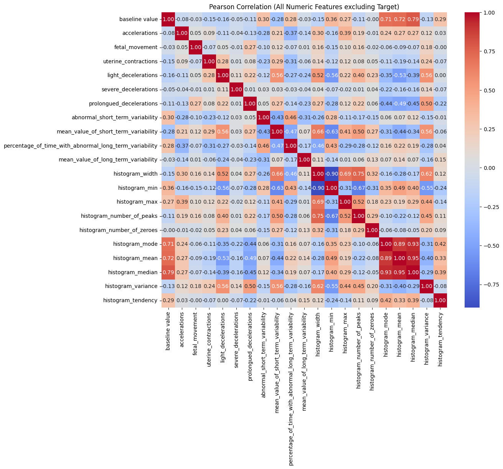

# 期中專案：胎兒健康狀態分類（Fetal Health Classification）

## 任務說明

降低兒童與孕產婦死亡率是全球重要的健康目標。胎心監護（Cardiotocogram, CTG）是一種簡單、成本低的胎兒健康評估方式，可記錄胎兒心率（FHR）與子宮收縮等資訊。

本專案是**三類別分類**問題：以 CTG 萃取的特徵，將胎兒健康狀態分類為：

| 標籤 | 類別 |
|---|---|
| 1 | Normal（正常） |
| 2 | Suspect（可疑） |
| 3 | Pathological（病理） |

研究問題：

1. 不同資料縮放方式（Standard vs MinMax）是否會影響 MLP 效能？
2. 不同類別編碼方式（Label vs One-Hot）是否有差異？
3. 不同模型深度（Small／Medium／Large）是否能提升預測能力？
4. 哪一組是最佳的 MLP 組合？
5. XGBoost 在表格資料上是否勝過 MLP？

## 資料集

- 來源：[Kaggle - Fetal Health Classification](https://www.kaggle.com/datasets/andrewmvd/fetal-health-classification)
- 檔案：`archive/fetal_health.csv`
- 原始 2,126 筆，刪除 13 筆重複資料後為 **2,113 筆**
- 21 項特徵，可分為四類：
  - **胎心率與基本活動**：`baseline value`、`accelerations`、`fetal_movement`、`uterine_contractions`
  - **胎心率減速**：`light_decelerations`、`severe_decelerations`、`prolongued_decelerations`
  - **變異性**：短期／長期異常變異性的時間百分比與平均值
  - **直方圖特徵**：`histogram_width`、`min`、`max`、`mode`、`mean`、`median`、`variance`、`tendency` 等
- 類別**明顯不平衡**，Normal 佔大多數

## 探索性資料分析（EDA）

- 沒有缺值；異常值可能代表真實的極端醫學狀況，因此**不刪除**
- `baseline value` 與 `histogram_mean`／`mode`／`median` 呈現極強的正相關（接近 1.0），有共線性問題

| 目標欄位分佈 | 散佈圖 |
|---|---|
|  |  |

## 資料前處理

- 去除重複值
- 特徵縮放：StandardScaler／MinMaxScaler
- 類別編碼：Label Encoding／One-Hot Encoding
- 資料切分：訓練 60%／驗證 20%／測試 20%
- 共線性處理：比較「保留全部欄位」與「刪除相關係數 > 0.8 的欄位」

## 實驗設計

### MLP 架構

| 架構 | 隱藏層數 | Units |
|---|---|---|
| Small | 1 | [64] |
| Medium | 2 | [128, 64] |
| Large | 2 | [256, 128] |

共同設定：Adam（lr = 0.001）、categorical crossentropy、Epochs 50、Batch size 32、Dropout 0.3、ReLU、Softmax 輸出、EarlyStopping（patience = 5）

### 實驗矩陣

編碼方式（Label／OneHot）× 縮放方式（Standard／MinMax）× 架構（Small／Medium／Large）= **12 組 MLP 實驗**，另加 **1 組 XGBoost** 對照組（`n_estimators=300`、`learning_rate=0.05`、`max_depth=5`、`objective=multi:softprob`）。

評估指標：Accuracy、Precision／Recall／F1（macro）、混淆矩陣、Loss／Accuracy 曲線

## 實驗結果

### Step 1：是否刪除高度相關欄位

| 實驗 | Loss | Accuracy | Precision | Recall | F1 |
|---|---|---|---|---|---|
| 不刪除欄位 | 0.2469 | 0.8936 | 0.8531 | 0.7455 | **0.7905** |
| 刪除欄位 | 0.2530 | 0.8936 | 0.8128 | 0.6986 | 0.7444 |

兩者差異不大，但不刪除欄位的結果稍好，因此後續 12 組實驗都**保留全部欄位**。

### Step 2：12 組 MLP 實驗

| 實驗 | Loss | Accuracy | Precision | Recall | F1 |
|---|---|---|---|---|---|
| E1 label_standard_small | 0.2575 | 0.8913 | 0.8709 | 0.7561 | 0.8021 |
| E2 label_standard_medium | 0.2244 | 0.9031 | 0.8201 | 0.7577 | 0.7858 |
| E3 label_standard_large | 0.2383 | 0.9007 | 0.8224 | 0.7387 | 0.7749 |
| E4 label_minmax_small | 0.2521 | 0.8960 | 0.8540 | 0.7673 | 0.8051 |
| **E5 label_minmax_medium** | 0.2206 | **0.9102** | 0.8200 | 0.8013 | 0.8103 |
| **E6 label_minmax_large** | **0.2137** | 0.9078 | 0.8604 | **0.8043** | **0.8301** |
| E7 onehot_standard_small | 0.4656 | 0.8605 | 0.7773 | 0.7532 | 0.7644 |
| E8 onehot_standard_medium | 0.3636 | 0.8723 | 0.8379 | 0.7216 | 0.7674 |
| E9 onehot_standard_large | 0.4022 | 0.8700 | 0.8356 | 0.7444 | 0.7772 |
| E10 onehot_minmax_small | 0.2800 | 0.9078 | **0.8937** | 0.7437 | 0.8017 |
| E11 onehot_minmax_medium | 0.3035 | 0.8983 | 0.8718 | 0.7417 | 0.7941 |
| E12 onehot_minmax_large | 0.3188 | 0.9007 | 0.8730 | 0.6893 | 0.7495 |

最佳兩組（E5、E6）的訓練曲線與混淆矩陣：

| | Accuracy | Loss | Confusion Matrix |
|---|---|---|---|
| E5 |  |  |  |
| E6 |  |  |  |

### Step 3：XGBoost 對照組

| 模型 | Accuracy | Precision | Recall | F1 |
|---|---|---|---|---|
| **XGBoost** | **0.9314** | **0.9270** | **0.8324** | **0.8715** |

## 結論

- **XGBoost 是整體表現最佳的模型**：所有指標都優於 12 組 MLP。樹狀模型本來就適合處理中小型表格資料的非線性關係與雜訊，訓練也快，適合作為這份資料的最終部署模型。
- **MinMaxScaler 搭配 Medium／Large 架構是較好的 MLP 組合**：E5、E6 的 Accuracy 與 F1 最高，和 XGBoost 差距不大。
- **Small 架構學習能力較弱**：胎心監護訊號的特徵關係較複雜，需要較深的網路。
- **是否刪除共線性欄位影響有限**：MLP 本身能學習特徵權重，加上 Dropout、EarlyStopping 的正則化效果；資料量小時刪除特徵反而可能損失資訊。

## 檔案說明

| 檔案 | 說明 |
|---|---|
| `程式碼.txt` | 程式碼（Google Colab 連結） |
| `archive/fetal_health.csv` | 資料集 |
| `深度學習期中專案.docx`／`.pdf` | 完整報告 |
| `*.png` | EDA、訓練曲線、混淆矩陣與模型比較圖 |

程式碼：[Google Colab](https://colab.research.google.com/drive/1Cf33unkuF909cJs4KR7ivudefAKDyQAo?usp=sharing)
