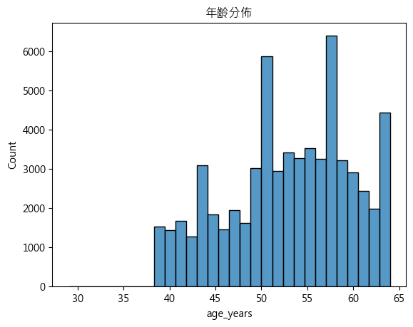
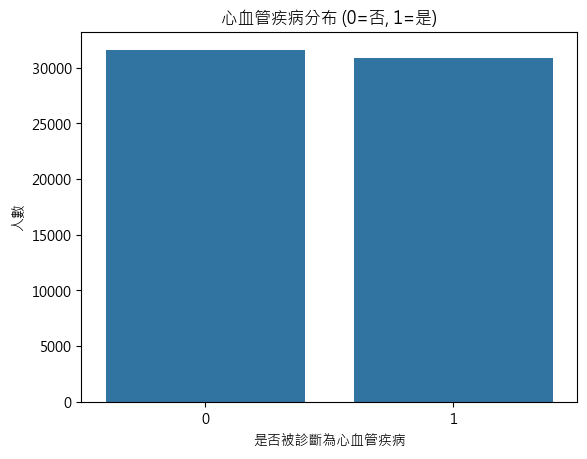
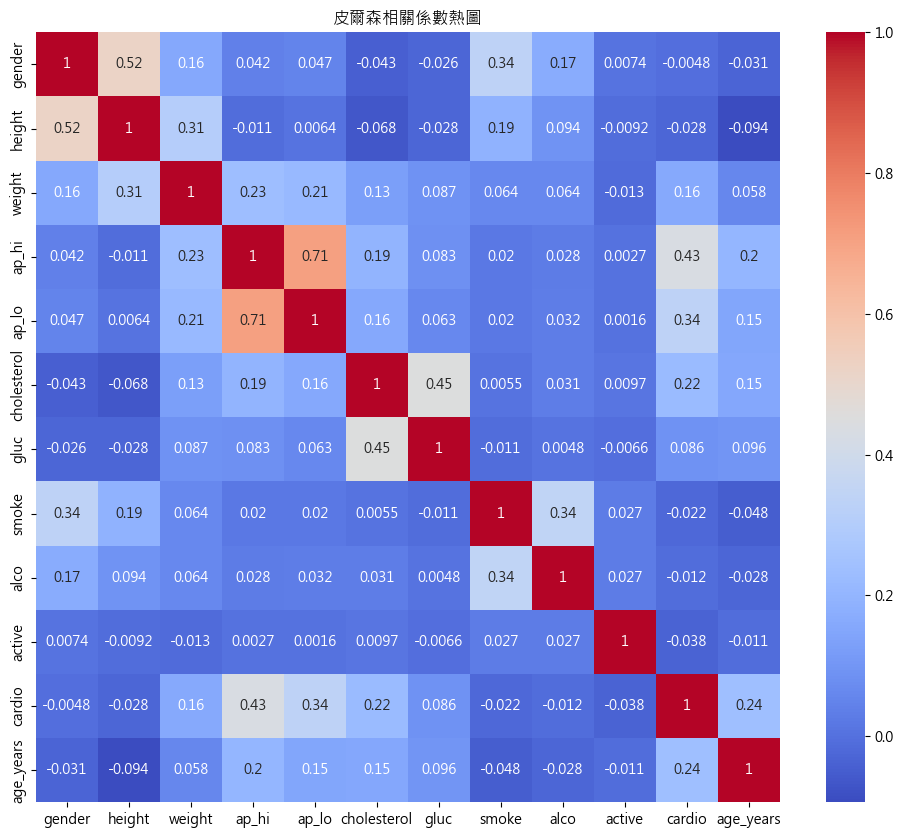
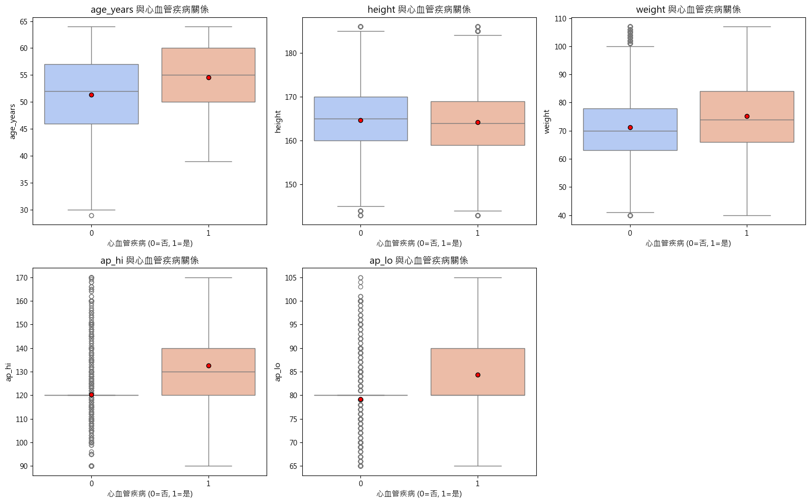
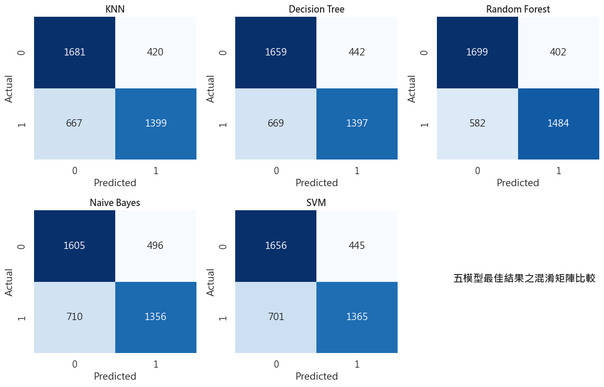

# 期初專案：心血管疾病分析（Cardiovascular Data Analysis）

## 任務說明

心血管疾病（Cardiovascular Disease, CVD）是全球主要的健康威脅之一，其風險與生理指標（血壓、膽固醇、血糖）以及生活習慣（吸菸、飲酒、運動）密切相關。

本專案是**二元分類**問題：根據患者的生理指標與生活習慣，預測是否患有心血管疾病（`cardio = 1` 表示患病，`cardio = 0` 表示未患病）。目標包括：

- 透過 EDA 找出影響心血管疾病的重要因素
- 建立並比較多種機器學習分類模型
- 透過前處理策略與超參數調整提升預測表現

## 資料集

- 來源：[Kaggle - Medical Examination Dataset Analysis](https://www.kaggle.com/datasets/scientificstephen/medical-examination-dataset-analysis)
- 檔案：`archive/medical_examination.csv`
- 清理後資料筆數：**62,492 筆**

| 類別 | 欄位 | 說明 |
|---|---|---|
| 基本特徵 | `age` | 年齡（單位：天，另轉換為 `age_years`） |
| | `gender` | 性別（1 男／2 女） |
| | `height`、`weight` | 身高（cm）、體重（kg） |
| 生理檢查 | `ap_hi`、`ap_lo` | 收縮壓、舒張壓 |
| | `cholesterol`、`gluc` | 膽固醇、血糖（1 正常／2 高於正常／3 遠高於正常） |
| 生活習慣 | `smoke`、`alco`、`active` | 吸菸、飲酒、規律運動（0 否／1 是） |
| 目標 | `cardio` | 是否患有心血管疾病 |

## 探索性資料分析（EDA）

- 資料沒有缺值，但有大量不合理的數值：舒張壓大於收縮壓、血壓高達 16000 或為負值、身高 55 cm、體重 10 kg 等
- 箱型圖顯示：患病族群的**年齡、體重、血壓**都明顯較高
- 直方圖顯示：**膽固醇、血糖**高於正常時，患病比例明顯上升

| 年齡分佈 | 目標欄位分佈 |
|---|---|
|  |  |

## 資料前處理

1. 新增 `age_years` 欄位（天 → 年），並刪除 `id`、`age`
2. 移除不合理的血壓值（`ap_hi <= ap_lo` 或非正數）
3. 移除 `gender` 的錯誤值
4. 對 `height`、`weight`、`ap_hi`、`ap_lo` 使用 IQR 法去除離群值
5. 去除重複值
6. 以 8:2 分出獨立測試集（stratified）

比較 4 種前處理策略：

| 策略 | 數值欄位 | 類別欄位 |
|---|---|---|
| 正規化 | MinMaxScaler | 不使用 |
| 正規化 + OneHot | MinMaxScaler | OneHotEncoder |
| 標準化 | StandardScaler | 不使用 |
| 標準化 + OneHot | StandardScaler | OneHotEncoder |

## 實驗設計

每個模型都使用 `Pipeline` 串接前處理與分類器，並用 `GridSearchCV` 搭配 5-Fold／10-Fold 交叉驗證搜尋最佳超參數。

| 模型 | 搜尋的超參數 |
|---|---|
| KNN | `n_neighbors` 1–20、`weights`、`p`（1 曼哈頓／2 歐幾里得） |
| Decision Tree | `criterion`、`max_depth`、`min_samples_split`、`min_samples_leaf` |
| Random Forest | `n_estimators`、`max_depth`、`min_samples_split`、`min_samples_leaf`、`criterion` |
| Naive Bayes | GaussianNB／BernoulliNB／MultinomialNB、`alpha` |
| SVM | `C`、`kernel`（linear／rbf）、`gamma`；資料切成三等份分別訓練後取平均 |

評估指標：Accuracy、Precision、Recall、F1-score、ROC AUC

## 實驗結果

各模型的最佳結果：

| 模型 | 前處理 | Accuracy | F1 | AUC |
|---|---|---|---|---|
| KNN | 標準化 + OneHot | 0.7157 | 0.6939 | 0.7743 |
| Decision Tree | 標準化 + OneHot（10-Fold） | 0.7226 | 0.7036 | 0.7838 |
| **Random Forest** | 正規化 + OneHot | 0.7254 | **0.7089** | **0.7909** |
| Naive Bayes | 標準化 + OneHot | 0.7054 | 0.6860 | 0.7596 |
| **SVM** | 標準化 | **0.7319** | **0.7100** | 0.7863 |

## 結論

- **Random Forest 綜合表現最佳**：AUC 最高，F1 也名列前茅，區分患病與未患病的能力最好；對數值縮放不敏感，但類別欄位經 OneHot 編碼後效果較好。
- **SVM 準確率最高**：只做數值標準化就能達到最佳效果，對患病者的辨識能力佳。
- **KNN 與 Decision Tree 表現中等**：適合當作 baseline 或輕量模型；KNN 對前處理與 k 值較敏感。
- **Naive Bayes 表現最弱**：推測是特徵獨立的假設與實際資料不符。
- **OneHot 編碼**在多數模型中都能提升穩定性，顯示類別欄位的處理方式對結果有明顯影響。

## 檔案說明

| 檔案 | 說明 |
|---|---|
| `HW1.ipynb` | 主程式：資料清理、EDA、5 種模型訓練與比較 |
| `KNN.ipynb`、`Dcision Tree.ipynb`、`Romdon Forest.ipynb`、`Naive Bayes.ipynb`、`SVM.ipynb` | 各模型的個別實驗 |
| `archive/` | 資料集 CSV |
| `深度學習期初專案.docx`／`.pdf` | 完整報告 |
| `*.png` | EDA 與結果圖表 |
