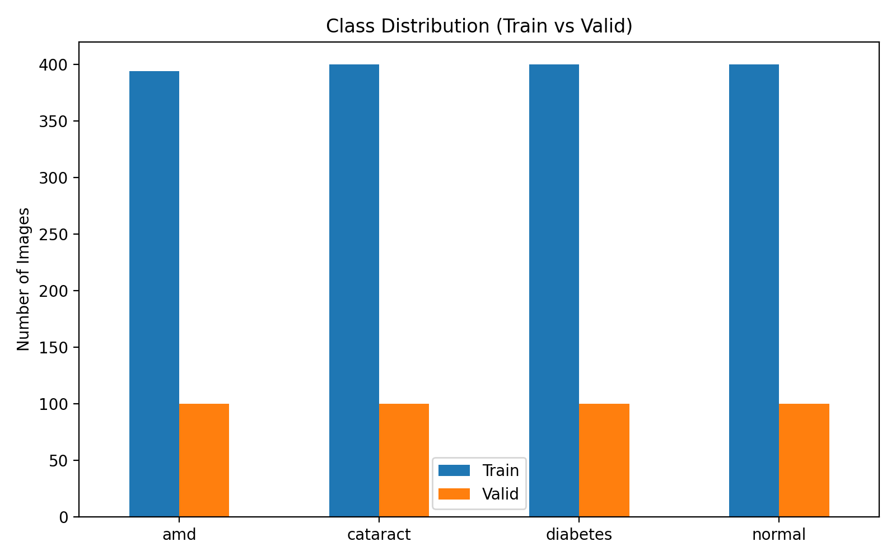
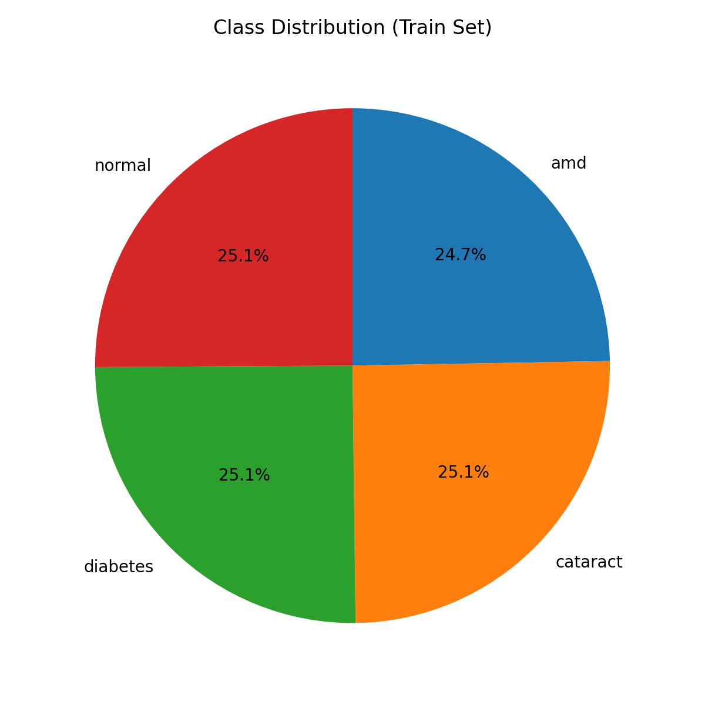
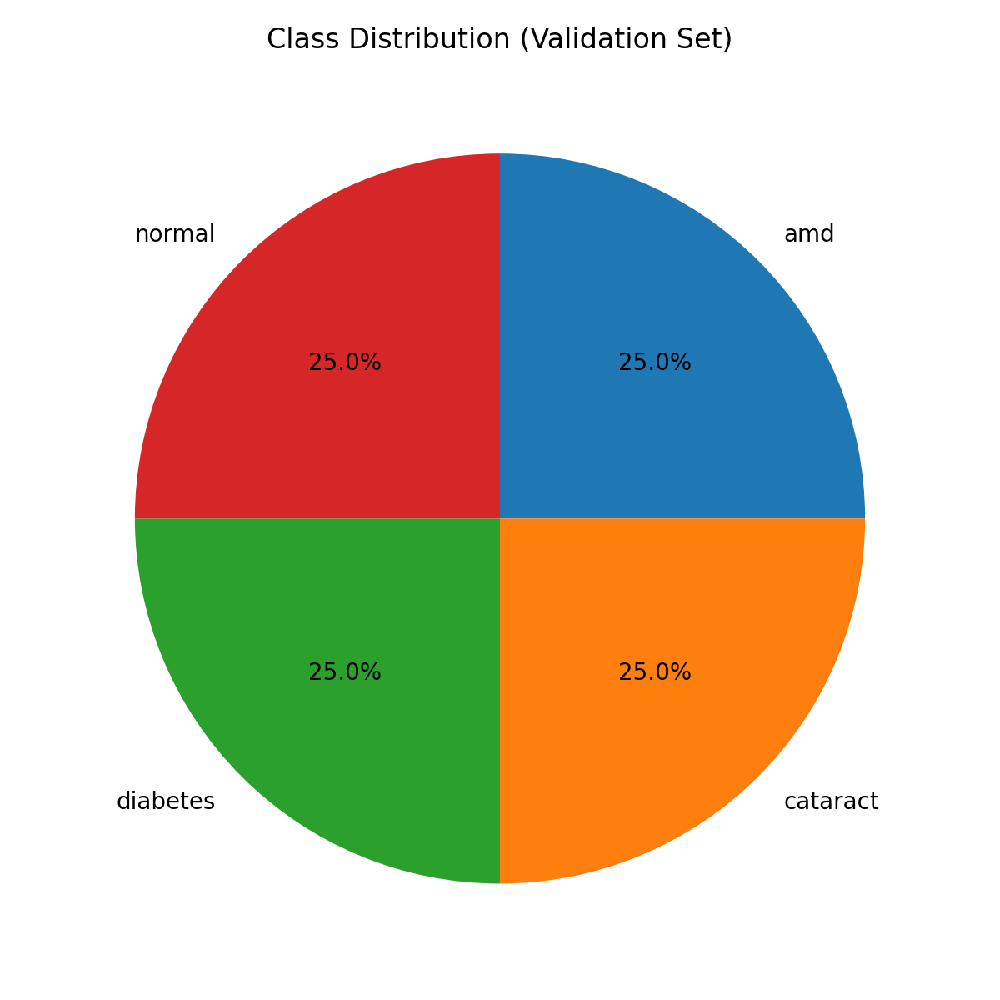
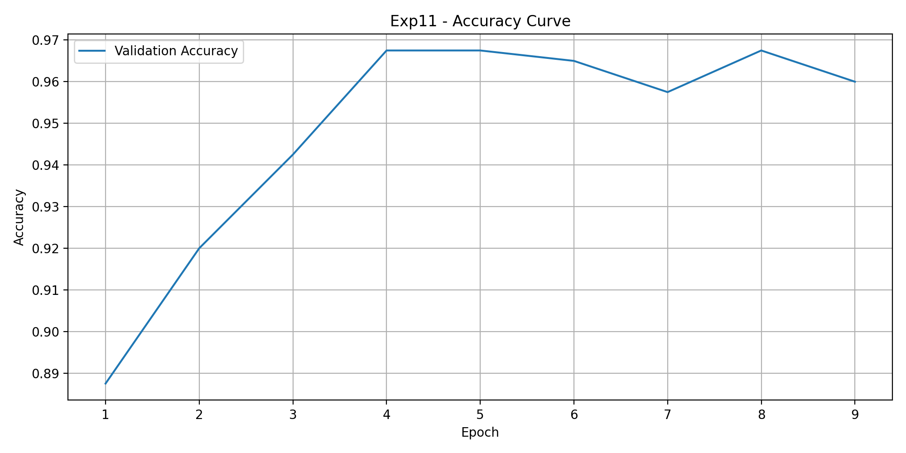
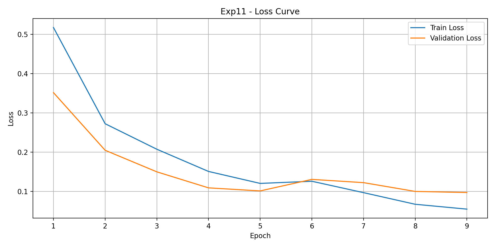
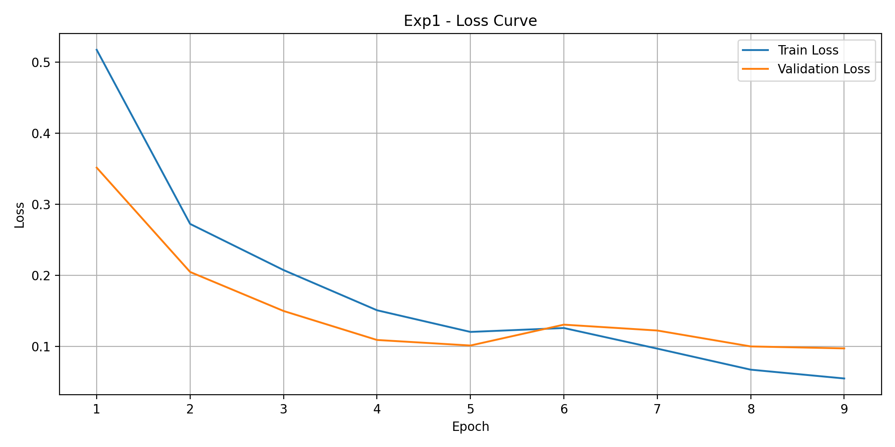

# 期末專案：黃斑部病變疾病分類（Macular Degeneration Disease Classification）

## 任務說明

老年性黃斑部病變（Age-related Macular Degeneration, AMD）是常見的眼部疾病，會影響視網膜中央區域，嚴重時可能導致失明。眼底影像是診斷的重要依據，但判讀仰賴醫師經驗且相當耗時。

本專案以**卷積神經網路（CNN）**對眼底影像做**四類別分類**，作為醫師診斷的輔助工具，並比較不同資料增強與訓練策略對模型效能的影響。

| 類別 | 說明 |
|---|---|
| `amd` | 黃斑部病變 |
| `cataract` | 白內障 |
| `diabetes` | 糖尿病視網膜病變 |
| `normal` | 正常 |

## 資料集

- 來源：[Kaggle - AMDNet23: Fundus Image Dataset for Age-Related Macular Degeneration Disease](https://www.kaggle.com/datasets/orvile/macular-degeneration-disease-dataset)
- 影像位於 `archive/AMDNet23 Dataset/{train,valid}/{amd,cataract,diabetes,normal}/`
- 使用資料集原本提供的 train／valid 切分，沒有另外建立測試集

| 切分 | amd | cataract | diabetes | normal | 合計 |
|---|---|---|---|---|---|
| train | 394 | 400 | 400 | 400 | 1,594 |
| valid | 100 | 100 | 100 | 100 | 400 |

Imbalance ratio（max/min）= 400 / 394 ≈ 1.02 < 1.5，屬於**相對平衡**的資料集。

| 類別分佈 | 訓練集比例 | 驗證集比例 |
|---|---|---|
|  |  |  |

## 資料前處理

- 所有影像統一調整為 **224 × 224**
- 轉換為 Tensor
- 使用 ImageNet 的平均值與標準差正規化（配合預訓練模型）
- 訓練集依實驗設定使用不同強度的資料增強（none／mid／strong），例如隨機水平翻轉、隨機旋轉；驗證集不做增強

## 實驗設計

### 模型

以 **ResNet18（ImageNet 預訓練）** 做遷移學習，將最後的全連接層改為 4 類輸出。

| 超參數 | 值 |
|---|---|
| Batch size | 32 |
| Epochs | 10 |
| Loss | CrossEntropyLoss |
| Dropout | 0.5 |
| 訓練技巧 | Data Augmentation、Early Stopping、ReduceLROnPlateau、Weight Decay |

### 實驗矩陣

比較資料增強強度、優化器、學習率與 Weight Decay，共 **12 組實驗**：

| 實驗 | Augmentation | Optimizer | LR | Weight Decay |
|---|---|---|---|---|
| Exp1 | none | Adam | 1e-4 | 0 |
| Exp2 | mid | Adam | 1e-4 | 0 |
| Exp3 | strong | Adam | 1e-4 | 0 |
| Exp4 | none | Adam | 1e-3 | 0 |
| Exp5 | mid | Adam | 1e-3 | 0 |
| Exp6 | strong | Adam | 1e-3 | 0 |
| Exp7 | none | SGD | 1e-2 | 0 |
| Exp8 | mid | SGD | 1e-2 | 0 |
| Exp9 | strong | SGD | 1e-2 | 0 |
| Exp10 | none | Adam | 1e-4 | 1e-4 |
| Exp11 | mid | Adam | 1e-4 | 1e-4 |
| Exp12 | strong | Adam | 1e-4 | 1e-4 |

評估指標：Accuracy、Loss、Precision／Recall／F1（macro）、混淆矩陣

## 實驗結果

依驗證集 Accuracy 排序（完整數據見 [`outputs_exp1_12/results_exp1_12_summary.csv`](outputs_exp1_12/results_exp1_12_summary.csv)）：

| 排名 | 實驗 | Aug | Optimizer | LR | WD | Val Accuracy | Val Loss | Precision | Recall | F1 |
|---|---|---|---|---|---|---|---|---|---|---|
| 1 | **Exp11** | mid | Adam | 1e-4 | 1e-4 | **0.9750** | 0.0932 | **0.9749** | **0.9750** | **0.9749** |
| 2 | Exp1 | none | Adam | 1e-4 | 0 | 0.9700 | 0.1089 | 0.9713 | 0.9700 | 0.9698 |
| 3 | Exp3 | strong | Adam | 1e-4 | 0 | 0.9700 | **0.0806** | 0.9702 | 0.9700 | 0.9698 |
| 4 | Exp8 | mid | SGD | 1e-2 | 0 | 0.9675 | 0.1253 | 0.9676 | 0.9675 | 0.9673 |
| 5 | Exp10 | none | Adam | 1e-4 | 1e-4 | 0.9675 | 0.1108 | 0.9686 | 0.9675 | 0.9674 |
| 6 | Exp12 | strong | Adam | 1e-4 | 1e-4 | 0.9675 | 0.1088 | 0.9677 | 0.9675 | 0.9676 |
| 7 | Exp9 | strong | SGD | 1e-2 | 0 | 0.9625 | 0.0943 | 0.9638 | 0.9625 | 0.9627 |
| 8 | Exp2 | mid | Adam | 1e-4 | 0 | 0.9625 | 0.1056 | 0.9625 | 0.9625 | 0.9624 |
| 9 | Exp7 | none | SGD | 1e-2 | 0 | 0.9550 | 0.1815 | 0.9568 | 0.9550 | 0.9541 |
| 10 | Exp4 | none | Adam | 1e-3 | 0 | 0.9500 | 0.1855 | 0.9553 | 0.9500 | 0.9503 |
| 11 | Exp6 | strong | Adam | 1e-3 | 0 | 0.9425 | 0.1664 | 0.9431 | 0.9425 | 0.9420 |
| 12 | Exp5 | mid | Adam | 1e-3 | 0 | 0.9275 | 0.2697 | 0.9374 | 0.9275 | 0.9254 |

最佳兩組（Exp11、Exp1）的訓練曲線與混淆矩陣：

| | Accuracy | Loss | Confusion Matrix |
|---|---|---|---|
| Exp11 |  |  |  |
| Exp1 |  |  |  |

## 結論

- **最佳設定為 Exp11**（mid 增強 + Adam + lr 1e-4 + weight decay 1e-4），驗證集 Accuracy 與 macro F1 都達 **0.975**。
- **學習率影響最大**：Adam 在 lr = 1e-4 時表現穩定在 0.96–0.975，改成 1e-3 後降到 0.93–0.95，Loss 也明顯變高。對預訓練模型做微調時，較小的學習率比較不會破壞已學到的特徵。
- **Weight Decay 有小幅幫助**：加入 1e-4 的 L2 正則化後，mid 增強的結果從 0.9625（Exp2）提升到 0.975（Exp11）。
- **資料增強的效果取決於其他設定**：在 lr = 1e-4 時各增強強度差異不大，其中 strong 增強（Exp3）的驗證 Loss 最低，泛化能力較好。
- **SGD（lr = 1e-2）也能達到 0.955–0.9675**，但整體仍略低於 Adam（lr = 1e-4）。
- ImageNet 預訓練的 ResNet18 在資料量不大（約 1,600 張訓練影像）的醫學影像任務上，10 個 epoch 內就能達到 95% 以上的準確率，顯示遷移學習的效益。

## 檔案說明

| 檔案 | 說明 |
|---|---|
| `HW(初版).ipynb` | 主程式：資料載入、EDA、前處理、ResNet18 訓練與評估 |
| `archive/AMDNet23 Dataset/` | 眼底影像資料集（train／valid） |
| `archive/dataset.csv` | 各類別影像數量統計 |
| `outputs_exp1_12/ExpN/` | 各組實驗的最佳模型權重（`ExpN_best_model.pth`）、訓練曲線、混淆矩陣、每類別指標（`*_per_class_metrics.csv`）與訓練歷程（`history_ExpN.csv`） |
| `outputs_exp1_12/results_exp1_12_summary.csv` | 12 組實驗結果彙整 |
| `結論/` | 報告使用的 EDA 與最佳實驗圖表 |
| `深度學習期末專案.docx` | 完整報告 |
